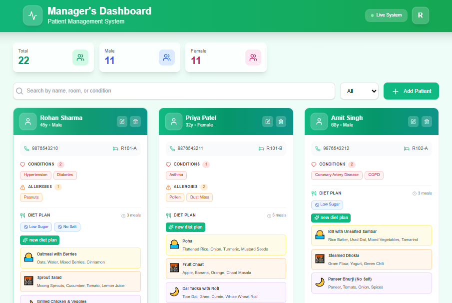
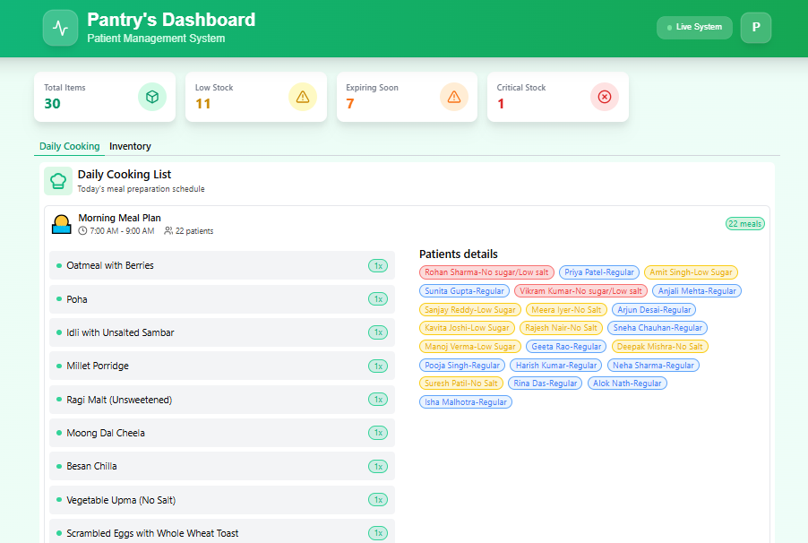
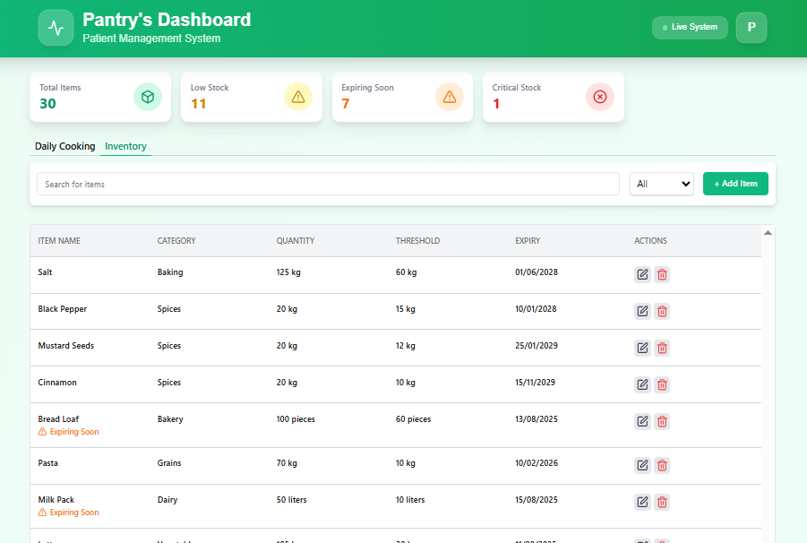

# HealMeal AI 🍲🤖

An **AI-powered Hospital Food Management System** that generates personalized diet plans for patients based on their diseases, allergies, and dietary restrictions. Includes **role-based access** for managers and pantry staff, with integrated inventory and daily cooking management.

---

## 🚀 Features

### 🏥 Patient & Diet Management
- AI-generated **personalized diet plans** based on diseases & allergies
- Add, update, and delete patient records (Manager role)
- Automatically adjust meal recommendations when patient conditions change

### 👩‍🍳 Pantry & Inventory Management
- Pantry staff can manage daily inventory items
- Track stock levels to avoid shortages
- View **daily cooking plans** based on AI-generated diets

### 🔐 Role-Based Access
- **Manager:** Full control over patients, diet plans, and inventory
- **Pantry Staff:** Inventory management & daily meal preparation tracking

---

## 🛠️ Tech Stack
- **Frontend:** React.js / Next.js + Tailwind CSS
- **Backend:** Node.js + Express.js
- **Database:** MongoDB
- **AI:** OpenAI API 
- **Authentication:** JWT with Role-based Authorization

---

## 📸 Screenshots

